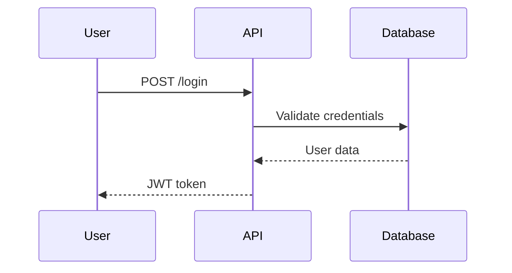

# Rule 21 — Project Documentation Standards

## Core Principle

Every project must have comprehensive documentation in a `docs/` folder. Documentation is not optional—it ensures maintainability, onboarding, and compliance.

## Quick Rules

- Create `docs/` folder at project root
- Follow the standard folder structure below
- Update documentation with every significant change
- Use diagrams for architecture and workflows
- Keep documentation version-controlled

## Required Folder Structure

```
docs/
├── 01-overview/
│   ├── README.md                 # Executive summary, purpose, quick-start
│   ├── FEATURES.md               # High-level capabilities
│   ├── GLOSSARY.md               # Domain-specific terminology
│   ├── USE-CASES.md              # User stories and scenarios
│   └── ROADMAP.md                # Planned features and timelines
│
├── 02-architecture/
│   ├── SYSTEM-OVERVIEW.md        # High-level architecture explanation
│   ├── SECURITY-ARCHITECTURE.md  # Threat models, auth, encryption
│   └── diagrams/
│       ├── sequence-diagram.png
│       ├── component-diagram.png
│       ├── deployment-diagram.png
│       ├── data-flow-diagram.png
│       ├── entity-relationship-diagram.png
│       ├── state-machine-diagram.png
│       ├── api-integration-diagram.png
│       └── cicd-pipeline-diagram.png
│
├── 03-data-api/
│   ├── DATABASE-SCHEMA.md        # Tables, indexes, constraints
│   ├── API-DOCUMENTATION.md      # Endpoints, request/response, errors
│   ├── DATA-DICTIONARY.md        # Key data element definitions
│   └── DATA-MIGRATION.md         # Database upgrade/migration steps
│
├── 04-development/
│   ├── CODING-STANDARDS.md       # Naming conventions, formatting
│   ├── ADR/                      # Architecture Decision Records
│   │   └── 001-initial-tech-stack.md
│   ├── CHANGELOG.md              # Release notes and updates
│   └── DEPENDENCIES.md           # Libraries, frameworks, versions
│
├── 05-testing/
│   ├── TEST-STRATEGY.md          # Unit, integration, system, acceptance
│   ├── TEST-CASES.md             # What's tested
│   ├── COVERAGE-REPORT.md        # Coverage metrics
│   ├── PERFORMANCE-TESTING.md    # Benchmarks, load testing results
│   └── ERROR-HANDLING.md         # Failure management and recovery
│
├── 06-deployment/
│   ├── SETUP-GUIDE.md            # Installation, env vars, ports
│   ├── DEPLOYMENT-GUIDE.md       # Manual and automated deployment
│   ├── MONITORING.md             # Metrics, dashboards, alerting
│   ├── BACKUP-RECOVERY.md        # Disaster recovery procedures
│   └── MAINTENANCE.md            # Patching, upgrading, deprecation
│
├── 07-compliance/
│   ├── REGULATORY-COMPLIANCE.md  # GDPR, HIPAA, PCI-DSS notes
│   ├── AUDIT-LOGGING.md          # Access and change tracking
│   └── RISK-ASSESSMENT.md        # Identified risks and mitigation
│
├── 08-collaboration/
│   ├── CONTRIBUTING.md           # How to contribute
│   ├── TEAM-ROLES.md             # Component ownership
│   └── COMMUNICATION.md          # Issue handling, updates protocol
│
└── 09-visuals/
    ├── ui-mockups/               # Screens and wireframes
    ├── workflow-diagrams/        # Business process flows
    └── error-flowcharts/         # Exception paths and fallbacks
```

## Document Templates

### README.md (Executive Summary)

```markdown
# Project Name

## Overview
Brief description of what this project does.

## Quick Start
1. Clone the repository
2. Install dependencies: `npm install`
3. Configure environment: `cp .env.example .env`
4. Run: `npm start`

## Documentation
See [docs/](./docs/) for full documentation.

## License
[License type]
```

### Architecture Decision Record (ADR)

```markdown
# ADR-001: [Decision Title]

## Status
[Proposed | Accepted | Deprecated | Superseded]

## Context
What is the issue we're addressing?

## Decision
What is the change we're making?

## Consequences
What are the results of this decision?
```

### API Documentation Entry

```markdown
## POST /api/users

Creates a new user.

### Request
```json
{
  "email": "user@example.com",
  "password": "securepassword"
}
```

### Response (201)
```json
{
  "id": "uuid",
  "email": "user@example.com",
  "createdAt": "2024-01-01T00:00:00Z"
}
```

### Errors
| Code | Description |
|------|-------------|
| 400  | Invalid input |
| 409  | Email already exists |
```

## Diagram Requirements

### Required Diagrams (Minimum)

| Diagram | Purpose | Tool Suggestions |
|---------|---------|------------------|
| System Overview | High-level components | Draw.io, Mermaid |
| ERD | Database relationships | dbdiagram.io, Mermaid |
| Sequence | Key user flows | Mermaid, PlantUML |
| Deployment | Infrastructure layout | Draw.io |
| CI/CD Pipeline | Build/deploy process | Draw.io, Mermaid |

### Mermaid Example (Embed in Markdown)

```markdown

```

## When to Update Documentation

| Event | Documents to Update |
|-------|---------------------|
| New feature | FEATURES.md, USE-CASES.md, API docs |
| Schema change | DATABASE-SCHEMA.md, ERD, DATA-DICTIONARY.md |
| Architecture change | SYSTEM-OVERVIEW.md, ADR, diagrams |
| Dependency update | DEPENDENCIES.md, CHANGELOG.md |
| Release | CHANGELOG.md, ROADMAP.md |
| Security change | SECURITY-ARCHITECTURE.md, COMPLIANCE docs |

## Documentation Checklist

- [ ] `docs/` folder created at project root
- [ ] README.md with quick-start guide
- [ ] System architecture documented with diagrams
- [ ] API endpoints documented
- [ ] Database schema documented
- [ ] Setup and deployment guides complete
- [ ] Coding standards defined
- [ ] At least one ADR for initial tech stack
- [ ] Test strategy documented
- [ ] Compliance requirements noted (if applicable)
